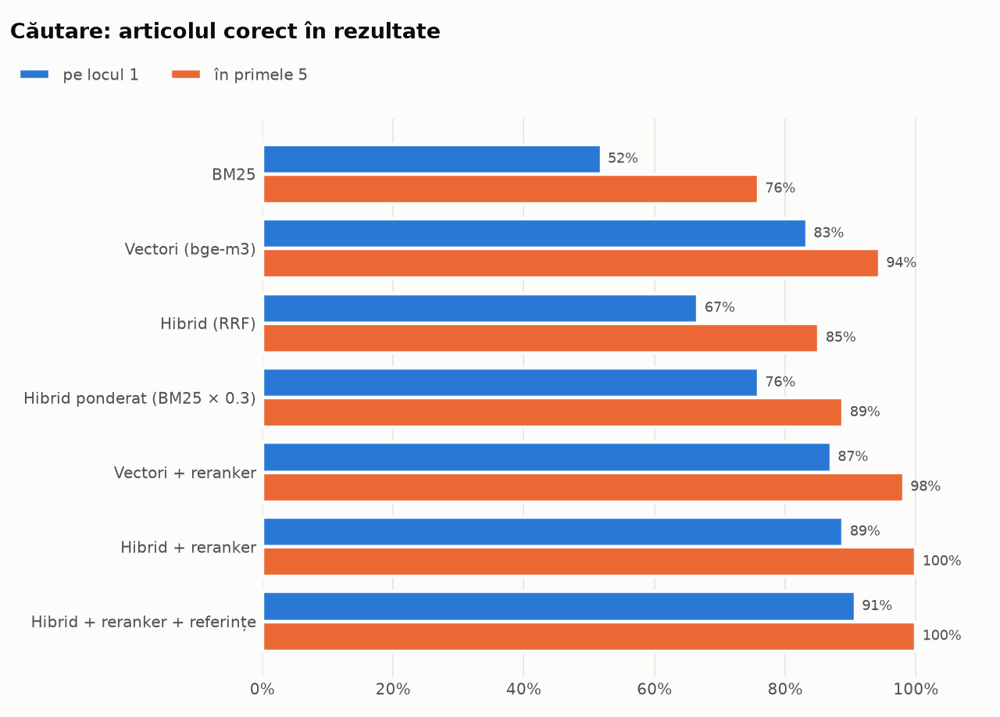
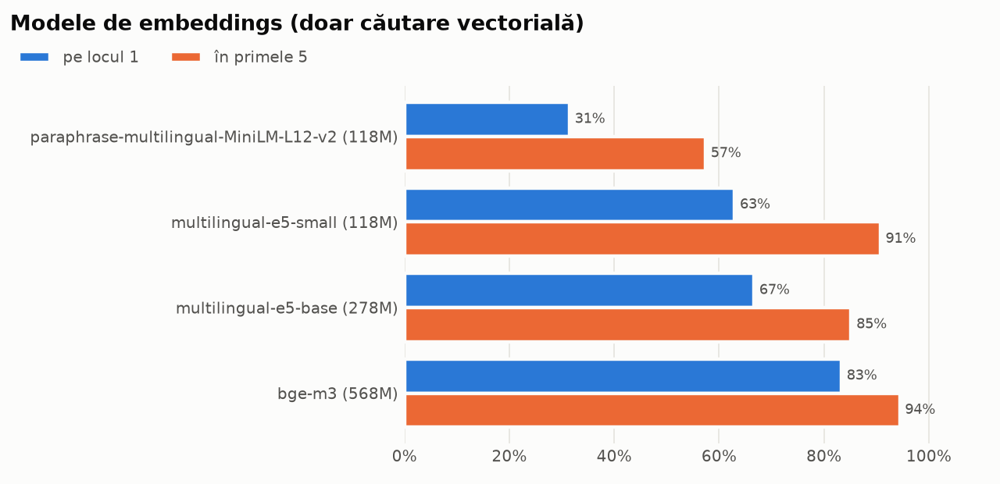

# Rezultatele evaluării

Set de evaluare: **59 de întrebări** ([data/eval/questions.jsonl](../data/eval/questions.jsonl)), fiecare cu articolul corect verificat manual în textul legii: 54 cu răspuns în legile indexate și 5 fără (pentru a testa refuzul).

> La 54 de întrebări, o întrebare valorează ~2%. Diferențele de câteva puncte procentuale trebuie citite cu prudență.

## 1. Variante de căutare

| Variantă | Recall@1 | Recall@3 | Recall@5 | MRR | Latență |
|---|---|---|---|---|---|
| BM25 | 52% | 70% | 76% | 0.623 | 1 ms |
| Vectori (bge-m3) | 83% | 93% | 94% | 0.881 | 19 ms |
| Hibrid (RRF) | 67% | 81% | 85% | 0.757 | 19 ms |
| Hibrid ponderat (BM25 × 0.3) | 76% | 87% | 89% | 0.822 | 19 ms |
| Vectori + reranker | 87% | 96% | 98% | 0.917 | 1098 ms |
| Hibrid + reranker | 89% | 96% | 100% | 0.931 | 1115 ms |
| Hibrid + reranker + referințe | 91% | 96% | 100% | 0.940 | 1128 ms |

**Concluzii**

- Căutarea vectorială e mult mai bună decât BM25 la întrebări în limbaj natural.
- Fuziunea simplă BM25 + vectori (RRF) e *mai slabă* decât vectorii singuri: BM25 primește aceeași greutate deși e mult mai slab.
- Cu reranker, BM25 devine util: aduce candidați pe care vectorii nu-i găsesc, iar reranker-ul îi alege pe cei buni. Varianta completă găsește articolul corect în primele 5 rezultate la toate întrebările.
- Reranker-ul costă ~1 s pe întrebare (pe Apple M4 Pro), un compromis acceptabil.

## 2. Modele de embeddings

| Model | Parametri | Dimensiune | Recall@1 | Recall@5 | MRR | Indexare |
|---|---|---|---|---|---|---|
| sentence-transformers/paraphrase-multilingual-MiniLM-L12-v2 | 118M | 384 | 31% | 57% | 0.427 | 3 s |
| intfloat/multilingual-e5-small | 118M | 384 | 63% | 91% | 0.748 | 6 s |
| intfloat/multilingual-e5-base | 278M | 768 | 67% | 85% | 0.742 | 16 s |
| BAAI/bge-m3 | 568M | 1024 | 83% | 94% | 0.881 | 55 s |

**Concluzii:** bge-m3 câștigă clar la Recall@1. Modelul E5-base, deși de 2,4× mai mare, nu bate E5-small. MiniLM, antrenat pe parafraze scurte, e nepotrivit pentru articole de lege.
